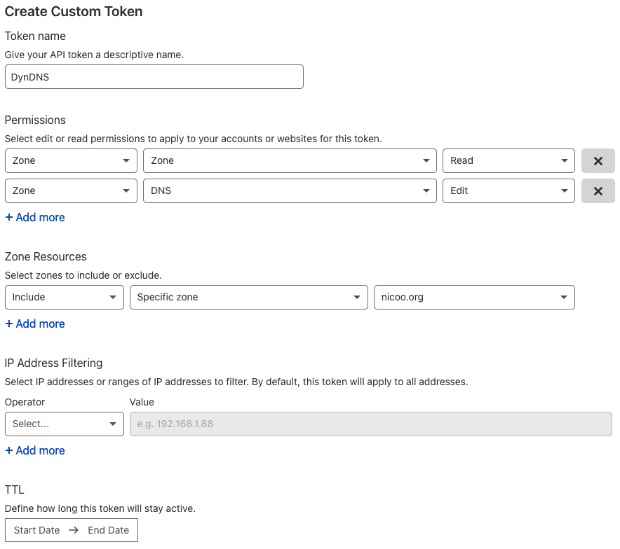
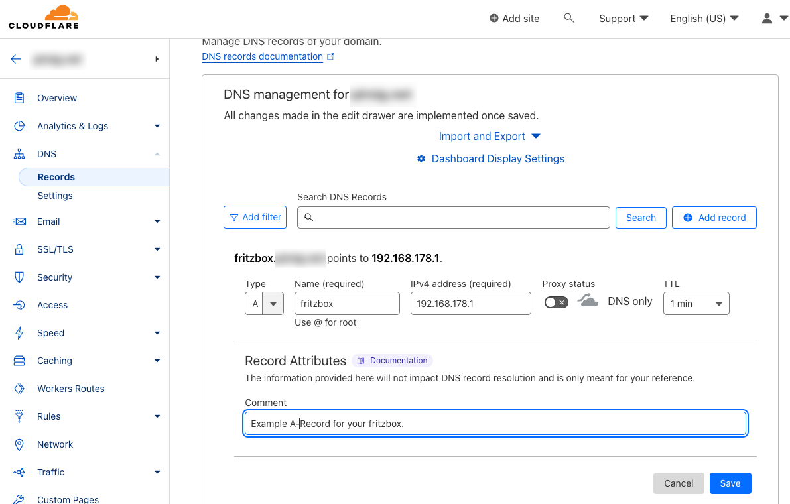
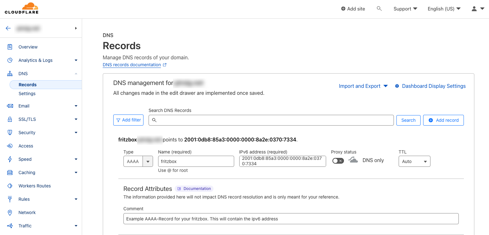
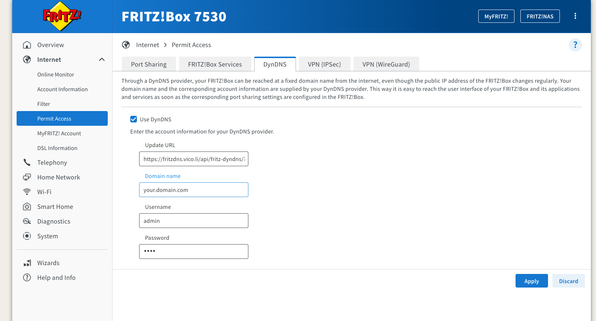

# Fritz!Box Cloudflare DynDNS Updater via Vercel

This is a DynDNS Service that can be used to update the IP address of a Fritz!Box to a Cloudflare DNS record. It supports updates of A- and AAAA-records. Every time your IP Address changes the service will be called by your Fritz!Box and the IP address will be updated.

## Setup Service and configure Fritz!Box

### Create a Cloudflare API token

Create a [Cloudflare API token](https://dash.cloudflare.com/profile/api-tokens) with **read permissions** for the scope `Zone.Zone` and **edit permissions** for the scope `Zone.DNS`.



### Create A- and AAAA-records for your domain in Cloudflare

Create an A- and AAAA-record for your domain in Cloudflare. The A-record should point to your IPv4 address and the AAAA-record should point to your IPv6 address.

Set the TTL of each Record to 1 minute. The Service will only update existing records. It will not delete or create new records, to avoid polluting your DNS zone in case of a configuration error.

#### A-Record example

The A-Record will be used to update your FRtIZ!Box IPv4 address in Cloudflare DNS. To create this record use a random IP Address and make sure the proxy is disabled and the TTL is set to 1 minute. After the configuration of your FRITZ!Box is done the record should be updated with your current IPv4 address.



#### AAAA-Record example

The AAAA-Record will be used to update your FRtIZ!Box IPv6 address in Cloudflare DNS. To create this record use a random IP Address for example `2001:0db8:85a3:0000:0000:8a2e:0370:7334` and make sure the proxy is disabled and the TTL is set to 1 minute. After the configuration of your FRITZ!Box is done the record should be updated with your current IPv6 address.



----

### Use the service

#### :rocket: Option 1: Self-host on Vercel

Deploy this project to your Vercel account and use it as a service for your FRITZ!Box.

[](https://vercel.com/new/clone?repository-url=https%3A%2F%2Fgithub.com%2Fpiscis%2Ffritzbox-cloudflare-dyndns-vercel&project-name=fritzbox-cloudflare-dyndns-vercel&repository-name=fritzbox-cloudflare-dyndns-vercel)

#### :cloud: Option 2: Use my Vercel cloud service for free

If you don't want to host "FRITZ!Box cloudflare DynDNS" yourself, feel free to use my cloud service. Just use this Update URL in your FRITZ!Box:

```
https://fritzdns.vico.li/api/fritz-dyndns/?token=<pass>&record=fritz.example.com&zone=example.com&ipv4=<ipaddr>&ipv6=<ip6addr>
```

### Configure your FRITZ!Box DynDNS Settings



| FRITZ!Box Setting | Value                                                                                                                            | Description                                                                                                                              |
| ----------------- | -------------------------------------------------------------------------------------------------------------------------------- | ---------------------------------------------------------------------------------------------------------------------------------------- |
| Update URL        | `https://fritzdns.vico.li/api/fritz-dyndns/?token=<pass>&record=fritz.example.com&zone=example.com&ipv4=<ipaddr>&ipv6=<ip6addr>` | Replace the URL parameter `record` and `zone` with your domain name. If required you can omit either the `ipv4` or `ipv6` URL parameter. |
| Domain Name       | fritz.example.com                                                                                                                | The FQDN from the URL parameter `record` and `zone`.                                                                                     |
| Username          | admin                                                                                                                            | You can choose whatever value you want.                                                                                                  |
| Password          | ●●●●●●                                                                                                                           | The API token you’ve created earlier.                                                                                                    |

Please note, if your use a Vercel deployment your service URL will be different. For example, if you're app is deployed to `https://some-random-name.vercel.app/` you have to use the following URL: `https://some-random-name.vercel.app/api/fritz-dyndns/?token=<pass>&record=fritz.example.com&zone=example.com&ipv4=<ipaddr>&ipv6=<ip6addr>`

```

----

## Development

### Prerequisites for Development

- NodeJS 18+
- PNPM
- Configure TakeOver Mode for VS Code (see below)

### Setup

Make sure to install the dependencies:

```bash
# Install dependencies via pnpm
pnpm install
```

### Development Server

Start the development server on `http://localhost:3000`

```bash
# Run development server
pnpm dev
```

### Production
Build the production application:

```bash
# Run production build
pnpm build
```

Locally preview production build:

```bash
# Run production build locally
pnpm preview
```

Check out the [deployment documentation](https://nuxt.com/docs/getting-started/deployment) for more information.

### Sources

  - Configure "take over" mode for volar in VS code: https://vuejs.org/guide/typescript/overview.html#volar-takeover-mode
  - Look at the [Nuxt 3 documentation](https://nuxt.com/docs/getting-started/introduction) to learn more.

----

## Credits

Original port for Vercel from: https://github.com/L480/cloudflare-dyndns


## ToDo`s

- [ ] A couple more tests for the API part
- [ ] Add more e2e tests for error handling on the frontend
