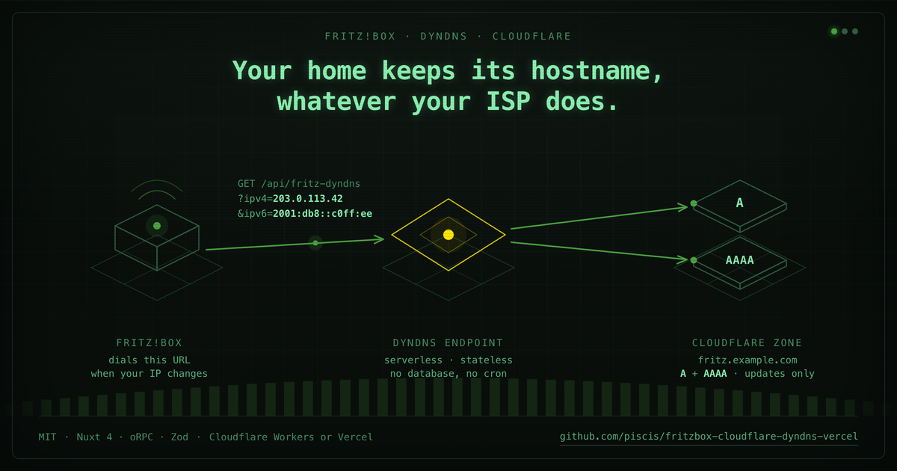
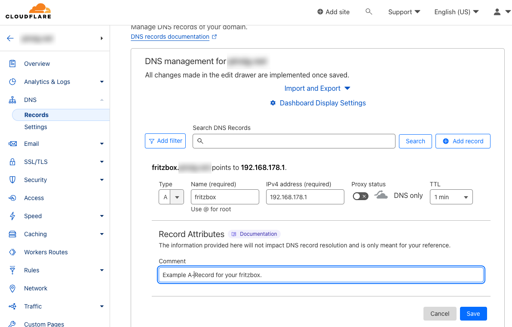
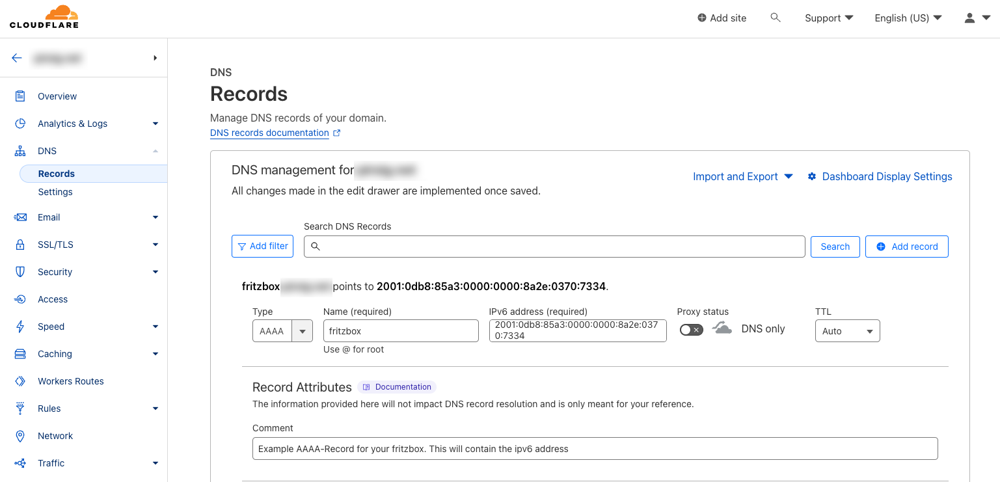
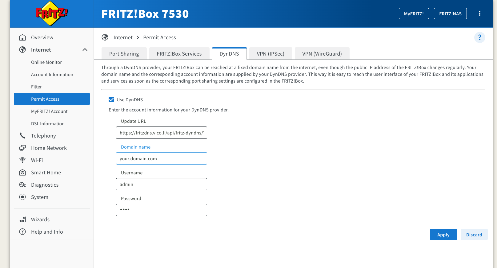

# Fritz!Box Cloudflare DynDNS Updater via Vercel / Cloudflare / etc. (Nuxt4 /VueJS / ORPC)

This is a DynDNS Service that can be used to update the IP address of a Fritz!Box to a Cloudflare DNS record. It supports updates of A- and AAAA-records. Every time your IP Address changes the service will be called by your Fritz!Box and the IP address will be updated.

✅ Key features:
1️⃣ Automatic Cloudflare DNS updates 🔄
2️⃣ Effortless deployment on Vercel with One-Click 🚀
3️⃣ Powered by Nuxt.js 🎨
4️⃣ Open-source for community collaboration 🌍
5️⃣ Supports both IPv4 and IPv6
6️⃣ Utilizes DNS A-Records and AAAA-Records instead of CNAME-Records (e.g., via Fritz.net)
7️⃣ Runs on the cloud in a serverless environment (vercel / cloudflare)

## Setup Service and configure Fritz!Box

### Create a Cloudflare API token

Create a [Cloudflare API token](https://dash.cloudflare.com/profile/api-tokens) with **read permissions** for the scope `Zone.Zone` and **edit permissions** for the scope `Zone.DNS`.


### Create A- and AAAA-records for your domain in Cloudflare

Create an A- and AAAA-record for your domain in Cloudflare. The A-record should point to your IPv4 address and the AAAA-record should point to your IPv6 address.

Set the TTL of each Record to 1 minute. The Service will only update existing records. It will not delete or create new records, to avoid polluting your DNS zone in case of a configuration error.

#### A-Record example

The A-Record will be used to update your FRITZ!Box IPv4 address in Cloudflare DNS. To create this record use a random IP Address and make sure the proxy is disabled and the TTL is set to 1 minute. After the configuration of your FRITZ!Box is done the record should be updated with your current IPv4 address.



#### AAAA-Record example

The AAAA-Record will be used to update your FRITZ!Box IPv6 address in Cloudflare DNS. To create this record use a random IP Address for example `2001:0db8:85a3:0000:0000:8a2e:0370:7334` and make sure the proxy is disabled and the TTL is set to 1 minute. After the configuration of your FRITZ!Box is done the record should be updated with your current IPv6 address.



----

### Use the service

#### :rocket: Option 1: Self-host on Cloudflare

Deploy this project to your Cloudflare account and use it as a service for your FRITZ!Box. Adjust the environment variables in the `.env` file to match your Cloudflare account and routing patterns.

```bash
cp .env.example .env

# Nuxt loads .env natively for `nuxt build`, so no extra tooling is needed.
NITRO_PRESET=cloudflare_module pnpm exec nuxt build

# wrangler does NOT read .env, so export the values for the deploy step.
set -a && . ./.env && set +a
pnpm exec wrangler --cwd .output deploy
```

> The `pnpm build:cf` and `pnpm deploy:cf` shortcuts are for maintainers — they pull
> configuration from Phase (see [Secrets](#secrets-maintainers)) and will not work
> without access to that org. The commands above are the equivalent for a fork.

If necessary make some adjustments to `nuxt.config.ts` to match your Cloudflare account and routing patterns. (see the nitro preset config in the [nuxt.config.ts](./nuxt.config.ts) file)

#### :rocket: Option 2: Self-host on Vercel

Deploy this project to your Vercel account and use it as a service for your FRITZ!Box.

[](https://vercel.com/new/clone?repository-url=https%3A%2F%2Fgithub.com%2Fpiscis%2Ffritzbox-cloudflare-dyndns-vercel&project-name=fritzbox-cloudflare-dyndns-vercel&repository-name=fritzbox-cloudflare-dyndns-vercel)

#### :cloud: Option 3: Use my ~~Vercel~~ Cloudflare cloud service for free

If you don't want to host "FRITZ!Box Cloudflare DynDNS" yourself, feel free to use my cloud service. Just use this Update URL in your FRITZ!Box:
This service is provided for free and without any warranty. Since this service is provided for free, I can't guarantee that it will always be available. If you need a more reliable service, please consider self-hosting.

**Please note** that this option is not secure due to the fact that the API token is visible in the URL. Although cloudflare REDACTS the API token in the logs it is still possible to get your API token by inspecting the network traffic. If you need a more secure option, please consider self-hosting.

```
https://fritzdns.piscis.dev/api/fritz-dyndns/?token=<pass>&record=fritz.example.com&zone=example.com&ipv4=<ipaddr>&ipv6=<ip6addr>
```

### Configure your FRITZ!Box DynDNS Settings



| FRITZ!Box Setting | Value                                                                                                                               | Description                                                                                                                              |
| ----------------- | ----------------------------------------------------------------------------------------------------------------------------------- | ---------------------------------------------------------------------------------------------------------------------------------------- |
| Update URL        | `https://fritzdns.piscis.dev/api/fritz-dyndns/?token=<pass>&record=fritz.example.com&zone=example.com&ipv4=<ipaddr>&ipv6=<ip6addr>` | Replace the URL parameter `record` and `zone` with your domain name. If required you can omit either the `ipv4` or `ipv6` URL parameter. |
| Domain Name       | fritz.example.com                                                                                                                   | The FQDN from the URL parameter `record` and `zone`.                                                                                     |
| Username          | admin                                                                                                                               | You can choose whatever value you want.                                                                                                  |
| Password          | ●●●●●●                                                                                                                              | The API token you’ve created earlier.                                                                                                    |

Please note, if you use a custom Vercel deployment your service URL will be different. For example, if you're app is deployed to `https://some-random-name.vercel.app/` you have to use the following URL: `https://some-random-name.vercel.app/api/fritz-dyndns/?token=<pass>&record=fritz.example.com&zone=example.com&ipv4=<ipaddr>&ipv6=<ip6addr>` service endpoint when configuring your FRITZ!Box DynDNS settings

### API reference

The service publishes an interactive OpenAPI reference. Open
`http://localhost:3000/api/` locally, or visit
[fritzdns.piscis.dev/api](https://fritzdns.piscis.dev/api/). The raw spec is at
`/api/spec.json`.

A health endpoint is available at `/api/health-check`.

----

## Development

### Prerequisites for Development

- Node.js 24 — see [`.nvmrc`](./.nvmrc) (`fnm use` / `nvm use`)
- pnpm 11 — pinned by the `packageManager` field; `corepack enable` picks it up automatically

### Setup

Make sure to install the dependencies:

```bash
# Install dependencies via pnpm
pnpm install
```

### Development Server

Start the development server on `http://localhost:3000`

```bash
# Run development server
pnpm dev
```

### Production
Build the production application:

```bash
# Run production build
pnpm build
```

Locally preview production build:

```bash
# Run production build locally
pnpm preview
```

Check out the [deployment documentation](https://nuxt.com/docs/getting-started/deployment) for more information.

### Environment variables

None of these is a runtime secret. The Cloudflare API token this service uses to change
DNS is the one your FRITZ!Box sends as the `token` query parameter on every request — it
is never read from the environment and never stored.

| Variable | Consumed by | When | Required |
| --- | --- | --- | --- |
| `NITRO_PRESET` | `nuxt.config.ts` → `nitro.preset` | build | Cloudflare/Vercel only |
| `CF_WORKER_NAME` | `nuxt.config.ts` → `wrangler.name` | build | Cloudflare only |
| `CF_ROUTE_PATTERN` | `nuxt.config.ts` → `wrangler.route.pattern` | build | Cloudflare only |
| `CF_LOG_ENABLED` | `nuxt.config.ts` → `wrangler.observability.enabled` | build | no |
| `CLOUDFLARE_API_TOKEN` | `wrangler deploy` | deploy | Cloudflare only |
| `CLOUDFLARE_ACCOUNT_ID` | `wrangler deploy` | deploy | Cloudflare only |

Every `CF_*` variable is consumed at **build** time, because `nuxt.config.ts` generates
`.output/server/wrangler.json` — so they must be set for `build:cf`, not only for
`deploy:cf`. There is no checked-in `wrangler.toml`.

The route is configured as a Cloudflare **custom domain**, which needs only a `pattern`;
Cloudflare infers the zone from the hostname. No `CF_ROUTE_ZONE_NAME` is required.

#### The two Cloudflare tokens are not interchangeable

This project uses Cloudflare API tokens for two unrelated purposes, and they need
different permissions. Mixing them up produces a confusing failure, because the wrong
token still authenticates — it just cannot do the job.

| | DynDNS token | Deploy token (`CLOUDFLARE_API_TOKEN`) |
| --- | --- | --- |
| Sent by | your FRITZ!Box, as `?token=` | `wrangler deploy`, from CI |
| Used to | update one A/AAAA record | upload and route a Worker |
| Permissions | `Zone.Zone: Read`, `Zone.DNS: Edit` | see below |

A deploy token needs, at minimum:

- **Account → Workers Scripts: Edit** — upload the Worker
- **Account → Account Settings: Read** — resolve the account
- **Zone → Workers Routes: Edit** — attach the custom-domain route
- **Zone → DNS: Edit** — a custom domain creates a DNS record
- **Zone → Zone: Read**

A DynDNS-scoped token used for deployment fails with
`Authentication error [code: 10000]` on `/accounts/<id>/workers/services/<name>`, *after*
wrangler has already printed the account name — so the log reads as if authentication
succeeded. Check the token's permissions rather than its value.

### Secrets (maintainers)

Build and deploy configuration lives in [Phase](https://phase.dev), on a self-hosted
instance. [`.phase.json`](./.phase.json) links this repo to the app; it contains only
opaque identifiers and is safe to commit. Maintainers: ask for the host URL and an
invite to the org.

```bash
brew install phase                        # or https://pkg.phase.dev/install.sh
export PHASE_HOST=https://phase.example.com   # the self-hosted host; add to your shell profile
phase auth
phase secrets list                        # sanity check: the Development set

pnpm dev                                  # runs through `phase run`
```

`phase run` spawns the child via `sh -c`, which does not have `node_modules/.bin` on
`PATH` — use `pnpm exec <bin>` inside it. Quote the whole command when it takes flags of
its own (`phase run "pnpm exec wrangler --cwd .output deploy"`), otherwise `phase` parses
them as its own.

Contributors without access to that Phase org should follow
[Option 1](#rocket-option-1-self-host-on-cloudflare) and use a `.env` instead.

### Deployments

Two Cloudflare Workers, one per stage. Which one a push targets is derived from the
branch, and the matching Phase environment supplies the Worker name and route — so
the two can never overwrite each other.

| Push to | GitHub Environment | Phase environment | Worker |
| --- | --- | --- | --- |
| `main` | `staging` | `Staging` | `fritzbox-cf-dyndns-stage` on `stage-fritzdns.piscis.dev` |
| `released` | `production` | `Production` | `fritzbox-cf-dyndns` on `fritzdns.piscis.dev` |

Pull requests run lint, typecheck and test only — they never deploy.

Both Workers use Cloudflare [Smart Placement](https://developers.cloudflare.com/workers/configuration/smart-placement/)
(`placement.mode: 'smart'`) and observability with full head sampling. That is set in
[`nuxt.config.ts`](./nuxt.config.ts) and baked into the generated
`.output/server/wrangler.json` at build time.

Release path: merge into `main` (deploys staging) → merge `main` into `released`
(deploys production).

### Testing

The suite is split into three Vitest projects:

| Project | Location | Environment | Covers |
| --- | --- | --- | --- |
| `unit` | `tests/unit/` | node | Everything under `server/`, with the Cloudflare SDK mocked — fast, never hits the network |
| `nuxt` | `tests/nuxt/` | nuxt | Component rendering under `app/` |
| `e2e` | `tests/e2e/` | node | A real Nuxt server booted via `@nuxt/test-utils/e2e` |

```bash
# Run everything once
pnpm test

# Watch mode for the local loop
pnpm test:watch

# A single project — `unit` runs in well under a second
pnpm test:unit
pnpm test:e2e

# With a coverage report (text + lcov + html in ./coverage)
pnpm test:coverage
```

Coverage is measured over `server/**` and gated in CI. Note that `--coverage` must
be passed as a flag rather than enabled in config: `@nuxt/test-utils` watches for it
to turn on client sourcemaps, without which `.vue` coverage is inaccurate.

> The DynDNS happy path is deliberately **not** covered end-to-end. The handler builds
> a real Cloudflare client from the caller-supplied token, so an e2e request would
> reach `api.cloudflare.com`. Only the validation failures — which are rejected before
> the client is constructed — are exercised over HTTP.

### Sources

  - Look at the [Nuxt 4 documentation](https://nuxt.com/docs/getting-started/introduction) to learn more.

----

## Working with AI agents

[`AGENTS.md`](./AGENTS.md) is the entry point — commands, architecture, and the
conventions that are not obvious from the code.

Skills live in [`.agents/skills/`](./.agents/skills/) (the canonical, vendor-neutral
location). `.claude/skills/<name>` are committed relative symlinks into it, so the
same set is available to Claude Code and to any tool that reads `.agents/`.

Vendored skills are pinned in [`skills-lock.json`](./skills-lock.json) — manage them
with `npx skills add|update|remove`, never by editing the lock file. The `orpc-api`
skill is first-party to this repo and is deliberately absent from the lock.

> On Windows, git needs `core.symlinks true` and a fresh checkout, or the symlinks
> materialise as plain text files.

Two MCP servers are registered per project: [`.mcp.json`](./.mcp.json) for Claude Code
and [`.cursor/mcp.json`](./.cursor/mcp.json) for Cursor. Both point at Nuxt's hosted
documentation endpoints — `https://nuxt.com/mcp` and `https://ui.nuxt.com/mcp` — so an
agent can look up current Nuxt APIs instead of recalling them from training data. They
carry no credentials, and they are duplicated rather than symlinked because each editor
watches its own path; a unit test keeps the two identical.

> Claude Code asks for approval the first time it sees a project `.mcp.json`. Answer
> yes once per clone — `claude mcp reset-project-choices` clears the answer.

## Contributing

Fork, branch, and open a PR against `main`. Please use
[Conventional Commits](https://www.conventionalcommits.org/) — `CHANGELOG.md` is
generated from them. Run `pnpm lint:fix && pnpm typecheck && pnpm test` before
opening the PR, and read [`AGENTS.md`](./AGENTS.md) first.

Security issues should go through [`SECURITY.md`](./SECURITY.md), not a public issue.

## Credits

Original port for Vercel from: https://github.com/L480/cloudflare-dyndns
